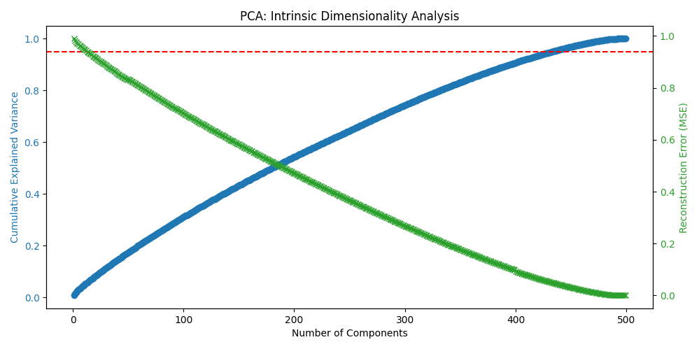

# Task 2.1 — PCA & Intrinsic Dimensionality

    This section explores the **Intrinsic Dimensionality** of our dataset using Principal Component Analysis (PCA) and evaluates how well our classifiers perform when running on "compressed" data

---

## 1) Intrinsic Dimensionality Analysis

Our original feature vector has **499 dimensions** (features). However, many of these features might be redundant (e.g., two pixels that are always the same color). PCA allows us to compress this information into fewer, more meaningful components.

We analyzed the **Cumulative Explained Variance** to answer find How many components do we need to preserve 95% of the information the results we got can be seen in the plot: 

* **Original Dimensions:** 499
* **Optimal Dimensions ($k$):** **~433** estimated by counting required dimensions to get %95 explained variance
* **Compression Ratio:** We reduced the dataset size by approximately **13%** while losing only 5% of the information., this is not a major decrease in data size, caused mostly by the linear idependence of thhe features.
### Reconstruction Error
We also calculated the Mean Squared Error (MSE) when reconstructing the images from the compressed data. As we added more components, the error dropped in an almost-linear fashion confirming that the dataset is largely linearly independent.

---

## 2) Classification on Reduced Data

[cite_start]We repeated the benchmarking study from Task 1.1 using only the compressed feature set ($433$ dimensions).

| Model | CV Mean Accuracy |            Test Accuracy | Fit Time (s) |
|---|-----------------:|-------------------------:|-------------:|
| Random Forest |          0.99125 |                     0.99 |        13.37 |
| LogReg (linear) |          0.96583 |                   0.9867 |        0.992 |
| SVM (linear) |          0.95125 |                   0.9767 |        0.774 |
| kNN |          0.93625 |                   0.9883 |        0.245 |
| SVM (RBF kernel) |         0.919583 |                  0.94167 |        3.091 |
| Naive Bayes (Gaussian) |           0.65625 |                     0.62 |        0.151 |
| LogReg + RBF Features |           0.61 |                   0.6483 |        5.496 |

### Interpretation
* **Performance Comparison:** the data, even after throving 67 dimensions is sufficient to train classifiers with higher than %99 accuracy
* **Efficiency vs. Accuracy:** The linear models (SVM, LogReg) maintained nearly identical performance (dropping less than 5%) despite being much faster to train.

---

## 3) Conclusion
The intrinsic dimensionality of the dataset is actually lower than 499. here PCA acted as a "noise filter" to decrease data dimensionality allowing us to build lighter, faster models without sacrificing significant predictive power.