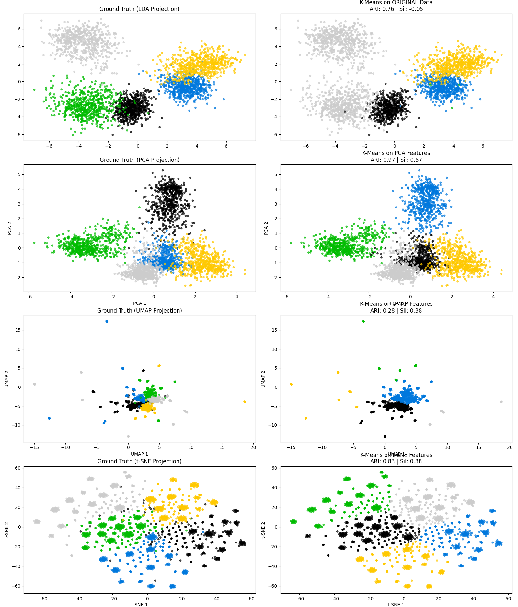

# Task 2.2 — Clustering Analysis

In this task, we ignored the labels (Unsupervised Learning) and asked: *"Can the computer discover the fruit categories on its own?"* We applied **K-Means Clustering** on four different versions of the data: Original, PCA, UMAP, and t-SNE

---

## 1) Methods & Metrics

We evaluated the quality of the clusters using two metrics:
* **Silhouette Score (Internal):** Measures how "tight" the clusters are. (Range: -1 to +1. Higher is better). [more info](https://en.wikipedia.org/wiki/Silhouette_(clustering))
* **Adjusted Rand Index - ARI (External):** Checks if the computer's clusters match the human's labels. (1.0 = Perfect Match). [more info](https://en.wikipedia.org/wiki/Rand_index#Adjusted_Rand_index)

---

## 2) Results Comparison

we tested 4 different methods, tuned hyperparameters for all of them, results are as:

visualization for the results we found :   

* **Raw K-Means:** we fed the data directly into k-means with 100 initializations, the ARI was decent, but silhouette score was the worst of them all, mainly because it basically merged 2 clusters into one
* **K-Means on PCA Plane:** we decreased data dimensionality with pca to 5, which turned out to be a sweet spot since the limitations of the K-means algorithm, it turned out to be the best of 4, with quite high ARI and decent Silhouette score.
* **K-Means on UMAP Plane:** we did the same by decreasing data dimensionality using umap, which diffused data and added some severe outliers, and resulting model is not so performance as can be seen.
* **K-Means on t-SNE plane:** we did the same bt decresing data simensionality, the result was decent on metrics, but data seemed to cluster quite a bit, leading to unreasonable when -for example- finding outliers etc.

---

## 3) Detailed Analysis

### The Winner: K-means on PCA plane
the K-means performed better than other 3 approaches by a considerable margin, hence we decided to use that one in our further analysises.
* **Visuals:** In the generated plots, this approach compressed the fruits into reasunably seperate clusters, actually comparabele to supervised methods like LDA (seen on base case plot.).
* **Performance:** K-Means performed best on this plane, due to the decreased dimensionality, with reasonable compromise in information

---

## 4) Verdict
The dataset structure is **weakly clustered**. we hence managed to get resonable performance on this without using label supervision.